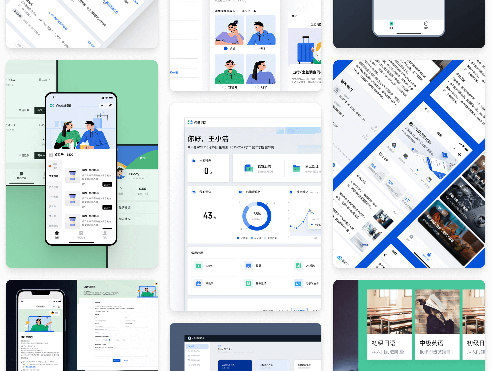

# 微搭低代码私有部署版

微搭低代码平台是由腾讯官方推出的低代码开发平台，专为简化开发流程而设计，同时与微信小程序生态无缝结合，广受开发者群体的欢迎。现已推出私有化部署版本，支持在本地机器上部署完整的低代码开发环境，极大地解决了数据隐私等问题。

微搭低代码私有部署版，以"最简单易用支持私有化部署的AI低代码平台"为理念，致力于为企业提供一站式的AI低代码开发解决方案。我们看到了市场上传统开发方式的瓶颈，为了解决这一问题，微搭低代码支持连接自有数据库，仅需三步即可快速开发管理系统和工作台。一键部署本地化系统到任意服务器，仅需5分钟即可完成安装运行。不仅如此，微搭低代码还支持从Excel、MySQL等数据模型自动生成管理页面，本地纯代码 / 低代码开发，可以灵活定制页面交互和CSS样式。为了保障数据安全，我们还自带用户权限管理和SSO单点登录能力，并带有企业级流程审批引擎。一码多端（小程序、web、H5），实时预览和分享，快速集成各类AI模型，我们微搭低代码，让开发变得更简单。

  
 

 

## 🌟 特点

- 📦 **一键部署**：支持一键部署本地化系统到任意服务器，仅需5分钟即可完成安装运行。
- 📊 **数据模型生成**：支持从Excel、MySQL等数据源自动生成管理页面。
- 🛠️ **灵活定制**：支持本地纯代码/低代码开发，可灵活定制页面交互和CSS样式。
- 🔒 **安全性**：自带用户权限管理和SSO单点登录功能，保障数据安全。
- 🏢 **企业级功能**：包含企业级流程审批引擎。
- 🖥️ **多端适配**：支持一码多端开发（小程序、Web、H5）。
- 🌐 **实时预览**：支持实时预览和分享功能。
- 🧠 **AI集成**：快速集成各类AI模型，提升应用智能化水平。
- 🤖 **AI大模型支持**：支持AI大模型的应用构建能力，使开发者能够轻松集成先进的AI技术

## 🚀 快速开始

1. **获取部署包**：下载部署代码包到本地，参考 [微搭私有部署官网](https://tcb.cloud.tencent.com/weda-software)
2. **部署**：运行部署脚本，按照文档提示完成部署，参考 [部署文档](https://docs.cloudbase.net/lowcode/private/deploy)
3. **配置数据库**：使用内置数据库，或者连接到您的自有数据库
4. **启动**：启动平台，开始您的微搭低代码本地开发之旅

## 📚 文档

详细文档请访问
- [微搭低代码产品使用文档](https://cloud.tencent.com/document/product/1301/67121)
- [微搭私有部署官网](https://tcb.cloud.tencent.com/weda-software)
- [私有化部署相关文档](https://docs.cloudbase.net/lowcode/private/deploy)

## 🤝 贡献

欢迎通过 Pull Requests 或 Issues 参与贡献，无论是功能增强、bug 修复还是文档改进。

---

微搭低代码平台，让开发更简单，让AI构建应用更快速。[立即开始](https://weda.cloud.tencent.com/) 低代码开发之旅。
